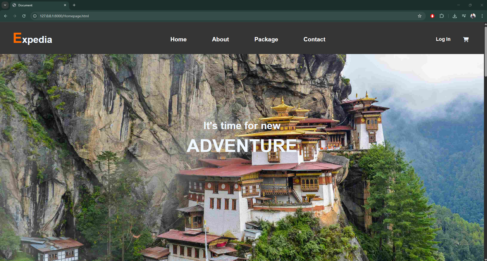
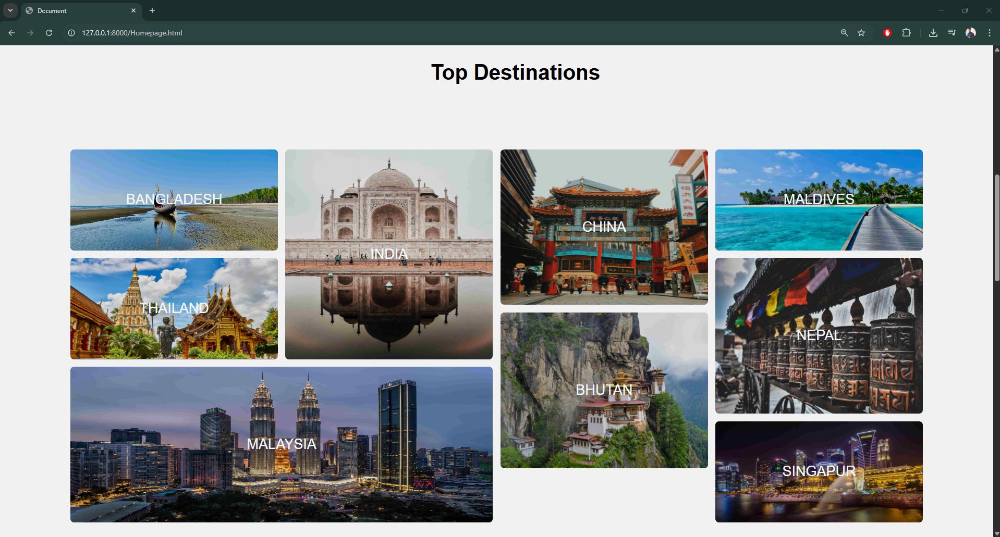
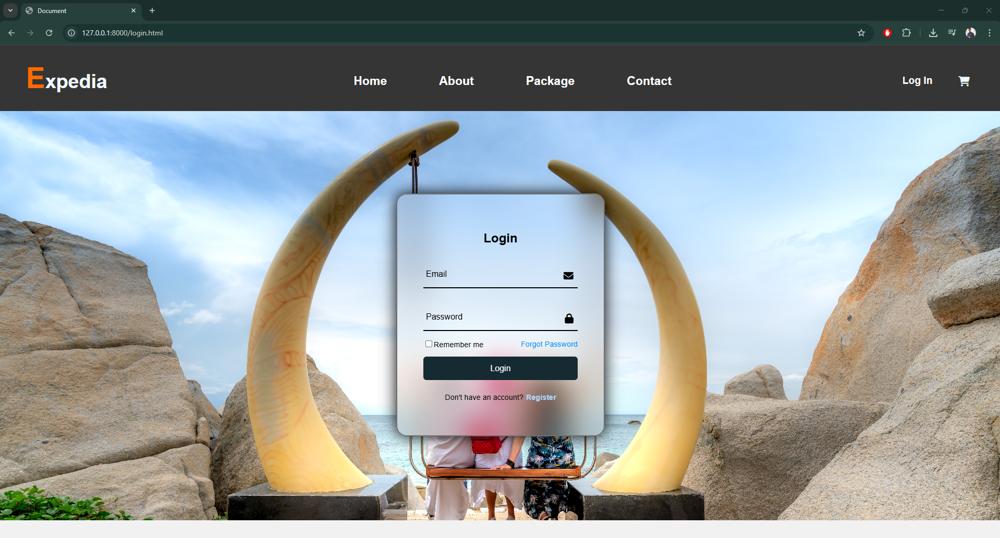
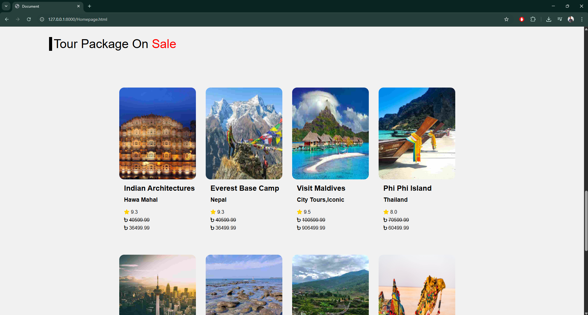
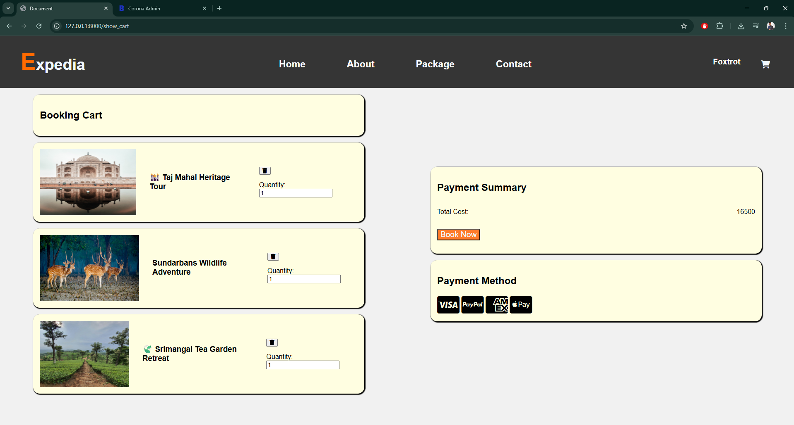
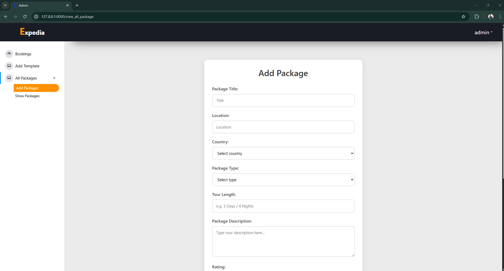
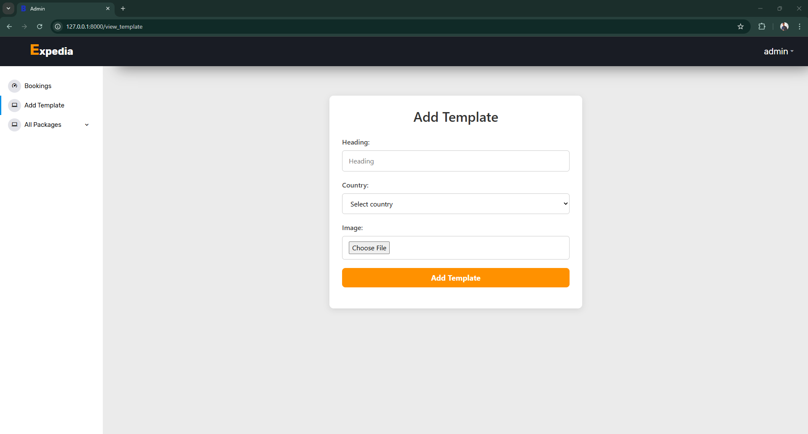
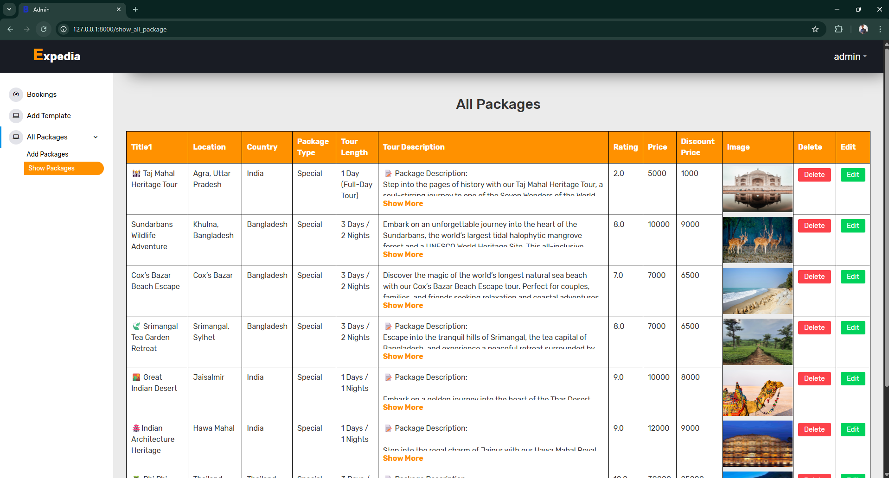
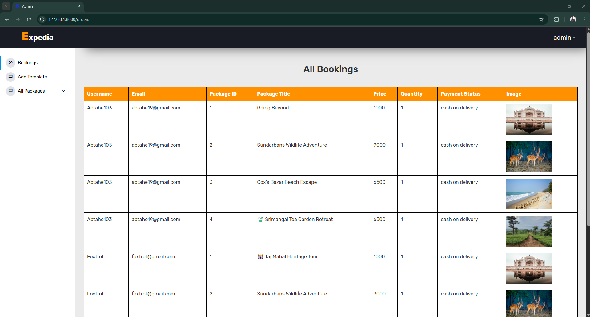

<h1>Tour and Travel Agency Website</h1>

<h2>Description</h2>

  The Tour and Travel Agency Website is a Laravel-based web application that enables users to explore and book the best tour packages with ease. The platform provides a seamless experience for both customers and administrators. Users can browse curated travel deals, add packages to their cart, and proceed with bookings, while the admin panel allows the agency to manage packages, bookings, and users.

<strong>Key features:</strong>
<ul>
  <li>Search and explore top-rated tour packages with details and pricing.</li>
  <li>User authentication system with login and registration features.</li>
  <li>Interactive user panel for managing carts and bookings.</li>
  <li>Admin panel for adding, editing, and deleting tour packages.</li>
  <li>Admin dashboard for viewing and managing customer bookings.</li>
  <li>Responsive design for smooth usage across all devices.</li>
</ul>

<h2>Technologies Used</h2>
<ul>
  <li><strong>Laravel</strong>: PHP web framework used for backend development.</li>
  <li><strong>MySQL</strong>: Relational database for storing package and user data.</li>
  <li><strong>Blade</strong>: Templating engine for frontend views.</li>
  <li><strong>Bootstrap</strong>: CSS framework used for responsive UI design.</li>
  <li><strong>jQuery</strong>: For dynamic front-end interactions.</li>
  <li><strong>Authentication System</strong>: Laravel built-in auth features.</li>
</ul>

<h2>How to Run the Project</h2>

  Follow these steps to set up and run the Laravel-based Tour and Travel Agency website locally:

<ol>
  <li>
    <strong>Install prerequisites:</strong>
    <ul>
      <li>PHP (version 8.0 or higher)</li>
      <li>Composer (dependency manager for PHP)</li>
      <li>MySQL (or MariaDB) database server</li>
    </ul>
    
Make sure these are properly installed and added to your system PATH.

  </li>
  <li>
    <strong>Clone the repository:</strong>
    <pre><code>git clone https://github.com/Abtahe103/Travel_Agency_Website_PHP-LARAVEL.git</code></pre>
  </li>
  <li>
    <strong>Navigate to the project directory:</strong>
    <pre><code>cd project-folder</code></pre>
  </li>
  <li>
    <strong>Install PHP dependencies via Composer:</strong>
    <pre><code>composer install</code></pre>
    
This will download and install all required Laravel packages.

  </li>
  <li>
    <strong>Set up environment configuration:</strong>
    <ul>
      <li>Open the <code>.env</code> file and update your database settings:</li>
      <pre><code>DB_DATABASE=your_database_name
DB_USERNAME=your_database_user
DB_PASSWORD=your_database_password</code></pre>
    </ul>
  </li>
  <li>
    <strong>Generate application key:</strong>
    <pre><code>php artisan key:generate</code></pre>
    
This command sets the app key in the <code>.env</code> file, required for encryption and sessions.

  </li>
  <li>
    <strong>Set up the database:</strong>
    <ul>
      <li>Create a new database manually in MySQL (using phpMyAdmin or CLI) that matches <code>DB_DATABASE</code> in your <code>.env</code>.</li>
      <li>Run database migrations to create tables:</li>
      <pre><code>php artisan migrate</code></pre>
    </ul>
  </li>
  <li>
    <strong>Run the development server:</strong>
    <pre><code>php artisan serve</code></pre>
    
By default, it will be accessible at <code>http://127.0.0.1:8000</code>.

  </li>
  <li>
    <strong>Visit the site:</strong>
    
Open your browser and go to <code>http://localhost:8000</code>. You should see the website homepage. Log in as admin or register a new user to explore full features.

  </li>
</ol>

<h2>Website Screenshots</h2>
<h3 style="text-align: center;">User Panel Screenshots</h3>

   
  <em>Fig 1: Website Homepage</em>
     

   
  <em>Fig 2: Grid Layout</em>
     

   
  <em>Fig 3: Login Page</em>
     

   
  <em>Fig 4: Tour Packages on Sale</em>
     

   
  <em>Fig 5: Countrywise All Tour Packages Sorted</em>
     

   
  <em>Fig 6: Specific Countrywise Tour Packages</em>
     

   
  <em>Fig 7: Tour Package Description</em>
     

   
  <em>Fig 8: Cart Design</em>
     

<h3 style="text-align: center;">Admin Panel Screenshots</h3>

   
  <em>Fig 9: Admin Panel - Add Package</em>
     

   
  <em>Fig 10: Admin Panel - Add Template</em>
     

   
  <em>Fig 11: Admin Panel - All Packages</em>
     

   
  <em>Fig 12: Admin Panel - Bookings Management</em>
     

<h2>🎬 Video Demonstration</h2>

  <a href="https://youtu.be/PHWogjisXTs?si=rUaRraUktmRdk2pZ" target="_blank">
    Video Demonstration Link
  </a>
    
    Click the link to watch the full video demonstration
     

